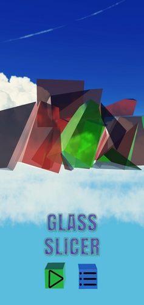
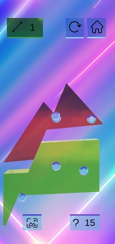
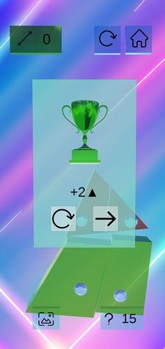

# Игра-головоломка Glass Slicer.
Glass Slicer - это игра, которая поможет вам расслабиться и проявить свой 
талант в решении сложных головоломок. Подарите себе моменты умиротворения, 
насладитесь спокойной и красочной атмосферой игры. Начните с легких уровней и 
переходите к более сложным по мере своего развития. Открывайте новые уровни и
достигайте новых вершин, становясь настоящим мастером разрезания стекла.

## Скриншоты игры:

## Установка:

1. Перейдите на страничку игры в [Google Play](https://play.google.com/store/apps/details?id=com.Ryabchenko.GlassSlicer).
2. Установите игру.

## Использование:

- В главном меню при нажатии на иконку старта игры начинается новая игра или продолжается старая.
- На экране "Уровни" вы можете выбрать для прохождения нужный уровень. Новые уровни открываются с прохождением предыдущих.
- Во время прохождения игры на экране уровня можно нажать на кнопку с иконкой "?" и получить подсказку. При использовании всех подсказок, есть возможность получить дополнительные подсказки после просмотра рекламы.
- После прохождения каждого уровня игрок получает некоторое количество игровой валюты с помощью которой может купить и сменить бэкграунд уровня. Внутриигровую валюту игрок также может получить за просмотр рекламы.

## API:

## GameManager:

Класс GameManager является основным контроллером игры, отвечающим за 
управление игровым процессом, и поведение игры. 

### События

- `OnStep()`: Происходит, когда игрок делает шаг в игре (один рез).
- `OnWin()`: Игрок выиграл.
- `OnLose()`: Игрок проиграл.
- `OnNextLvl()`: Игрок перешел на следующий уровень.
### Методы

- `UseHint()`: Игрок использовал подсказку.
- `AddHint(int numHints)`: Добавляет подсказок, параметр - количество подсказок.

## DataLoaderSaver:

DataLoaderSaver - класс, отвечающий за сохранение и загрузку игровых данных.

### Методы

- `SaveData(GameInfo gameInfo)`: сохраняет данные с прогрессом игры.
- `LoadLevelData()`: подгружает данные о конфигурации уровней.
- `LoadGameData()`: подгружает данные о прогрессе игры.
- `DeletePersistentDataFile()`: очищает данные из внутреннего хранилища устройства, сбрасывает прогресс. Используется только в тестировании.

## GameInfoEditor:

GameInfoEditor - это класс, отвечающий за редактирование игрового прогресса. Позволяет редактировать
актуальный уровень, максимально доступный, количество доступных подсказок.

### Методы

- `SaveJson()`: Сохраняет отредактированную информацию в JSON.
- `LoadJson()`: Подгружает в редактор информацию из JSON.
- `DropProgress()`: Сбрасывает прогресс прохождения.

## LevelEditor:

LevelEditor - это класс, отвечающий за редактирование уровней в игре. Каждый уровень - набор координат вершин, 
центров мешей, координаты пинов, координаты линий правильного ответа, количество доступных шагов 
для выигрыша.

### Методы

- `LoadNextLevel()`: Сохраняет изменения и подгружает следующий уровень в редактор.
- `LoadPreviousLevel()`: Сохраняет изменения и подгружает предыдущий уровень в редактор.
- `SaveJson()`: Сохраняет отредактированную информацию в JSON.
- `LoadJson()`: Подгружает в редактор информацию из JSON.
- `CopylevelData()`: Копирует в промежуточный буфер текущий уровень.
- `PastelevelData()`: Вставляет из промежуточного буфера скопированный уровень.
- `OnDrawGizmos()`: тут отрисовываются все элементы уровня в примитивном виде.
- 
## MeshGenerator:

MeshGenerator - это класс, отвечающий за генерацию 3D меша фигуры-многоугольника из 
координат вершин и с заданной толщиной.

### Методы

- `BuildShape(Shape shape)`: Мастер-метод, управляющий процессом сборки меша.
- `CalcBackVertices(Shape shape)`: Метод вычисляет заднюю стенку меша.
- `GenerateMesh(Vector3[] polygonVertices, Vector3 centralVert)`: Метод генерирует меш.
- `GenerateTriangles(int vertexCount)`: Вычисляет треугольники(правильный порядок) для меша.
- `CalculateUV(Mesh mesh)`: Вычисляет UV координаты для меша.

## RewardedAdsButton:

RewardedAdsButton - класс определяет поведение кнопки, вызывающей рекламу. Имеет два дочерних класса: `HintRewardedAdsButton`, `MoneyRewardedAdsButton`.
Скрипты позволяют получить за просмотр рекламы подсказки или игровую валюту соответственно.

### Методы

- `LoadAd()`: Метод, подгружающий рекламу.
- `OnUnityAdsAdLoaded(string adUnitId)`: Событие происходит, когда реклама загружена и готова к показу.
- `ShowAd()`: Метод запускает показ рекламы.
- `OnUnityAdsShowComplete`: событие, происходящее при успешном просмотре рекламы. Переопределяется в дочерних
классах, позволяющих получать различную награду.

___
## Контакты:
[LinkedIn: **ryabchenko**](https://www.linkedin.com/in/ryabchenko)  
[Telegram: **whyv2**](https://t.me/whyv2)    
[Email: **00bl@bk.ru**](mailto:00bl@bk.ru)
